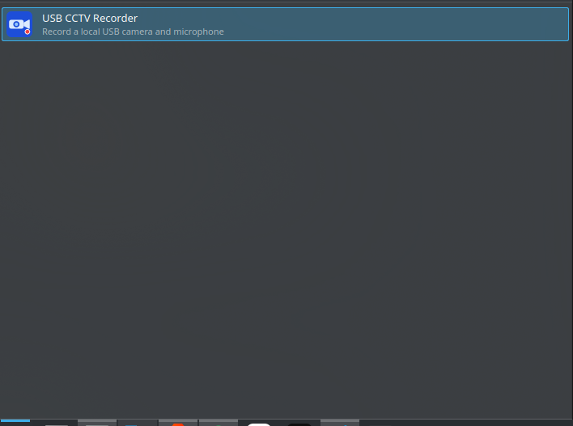
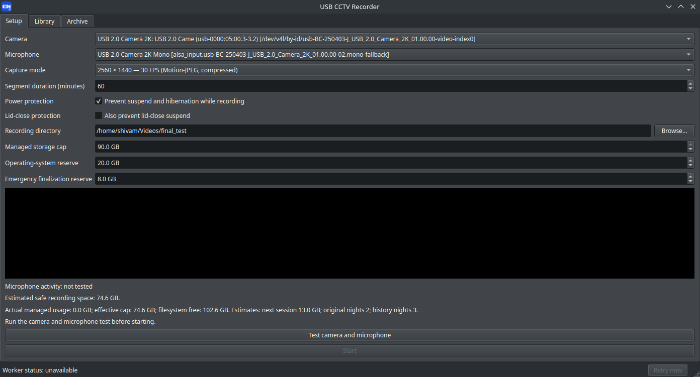
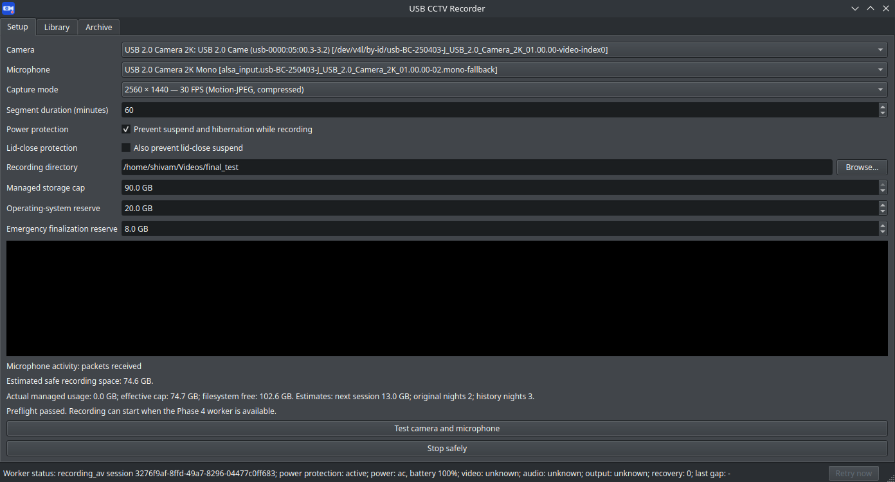
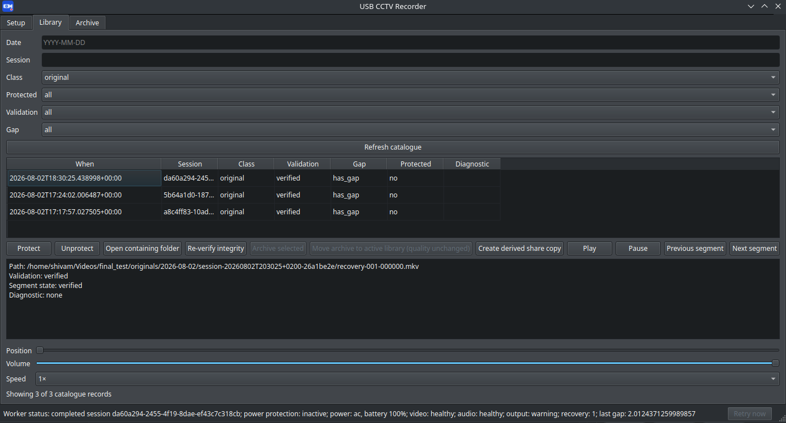
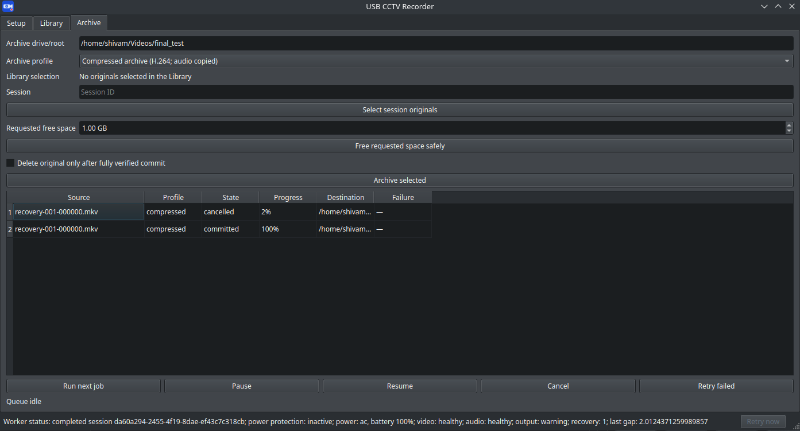
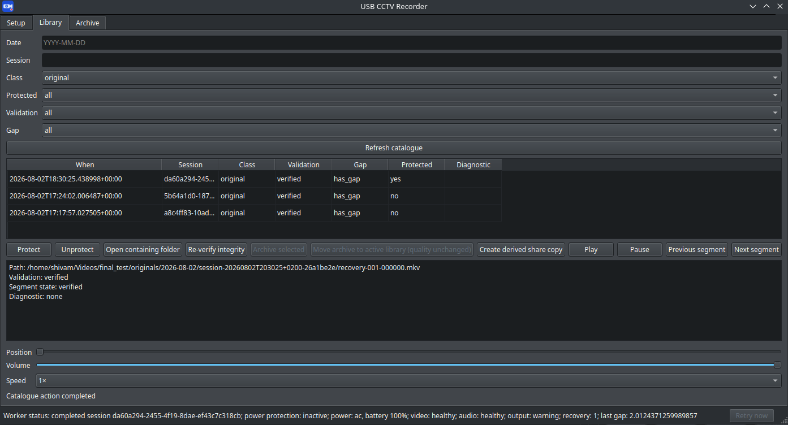

# USB CCTV Recorder

USB CCTV Recorder is a local desktop application for continuously recording **one USB webcam and
its microphone** on a Linux desktop. It records segmented Matroska (`.mkv`) files, keeps a local
library of originals and archives, and is designed to preserve recordings conservatively when
capture, storage, or archive work fails.

It is a local-only application: it has no cloud upload, remote access, network listener, or
telemetry.

## Supported platform

The release package supports:

- Ubuntu or Kubuntu 24.04 amd64
- KDE Plasma 5.27 on an X11 session
- One compatible USB webcam with a microphone
- FFmpeg, PipeWire-Pulse/PulseAudio compatibility, V4L utilities, and systemd

The `.deb` bundles the application runtime and declares the required system packages. Use the KDE
package installer on a machine with its normal Ubuntu package repositories available; no Python,
virtual environment, or developer tools are required.



## Install

1. Download `usb-cctv-recorder_0.1.0_amd64.deb`.
2. Open the file in KDE's package installer and choose **Install**. Enter your administrator
   password when prompted.
3. The installer obtains declared dependencies such as FFmpeg automatically from the configured
   Ubuntu repositories.
4. Open **USB CCTV Recorder** from the KDE application menu.

If you prefer a terminal, the equivalent command is:

```bash
sudo apt install ./usb-cctv-recorder_0.1.0_amd64.deb
```

Do not use `dpkg -i` alone unless you are prepared to resolve missing dependencies yourself.

## What it does

- Records one selected camera and microphone to segmented `.mkv` files.
- Uses a stable camera identity and explicit microphone source instead of silently switching to a
  different device when `/dev/videoN` numbers change.
- Tests the camera preview and microphone activity before recording starts.
- Safely finalizes the active segment when you stop recording; short final segments are retained.
- Validates completed media, calculates SHA-256 checksums, and writes session manifests and event
  journals beside recordings.
- Keeps recording independent of the open window: closing the GUI does not stop an active session.
- Blocks suspend and hibernation during recording by default; optional lid-close protection is
  available.
- Monitors camera, audio, output growth, and worker health. It records explicit gaps and recovers
  into a new segment rather than appending to uncertain media. Audio-only or video-only recovery
  is used when only one source is available.
- Provides a local Library for filtering, playback, integrity re-verification, protection, and
  diagnostics for missing or damaged media.
- Archives recordings through a durable queue, supports a compressed archive or an original-quality
  move, and can create clearly labelled derived share copies.
- Applies a storage governor with a 90 GB maximum managed footprint, configurable reserves, and
  protection-aware cleanup. Protected, current, partial, quarantined, and unverified media are
  not automatically deleted.

## Quick start: set up and record

1. Open the **Setup** tab and wait for the camera and microphone list to load.
2. Select your webcam, its microphone, and a supported capture mode.
3. Choose a segment duration. The allowed range is 1–360 minutes; 60 minutes is the default.
4. Choose an absolute recording directory. The preselected location is your Videos folder; a
   dedicated `~/Videos/USB-CCTV-Recorder/` folder is recommended.
5. Review the storage cap and safety reserves. The effective capacity may be below 90 GB because
   the application preserves operating-system and emergency-finalization space.
6. Leave **Prevent suspend and hibernation while recording** enabled unless you deliberately want
   a different power policy. Enable lid-close protection only if required.
7. Click **Test camera and microphone**. Confirm that the preview appears and microphone activity
   is detected.
8. Click **Start**. The button changes to **Stop safely** while a session is active.



## While recording

The status bar shows worker state, power protection, AC/battery state, video/audio/output health,
recovery attempts, and the last recorded gap.

- You can turn the display off, lock KDE, or disconnect an external display while recording.
- You may close the main window; recording continues in the on-demand user worker. Reopen the app
  to check the live status.
- If capture is recovering, use **Retry now** after reconnecting the same camera or microphone.
- To finish normally, reopen the app and select **Stop safely**. Wait for finalization before
  shutting down, upgrading, or uninstalling the package.



## Browse and protect recordings

Open the **Library** tab to work with originals, archives, share copies, quarantine entries, and
visible recording gaps.

1. Use filters for date, session, media class, protected state, validation state, and gap state.
2. Select a recording to view its details and diagnostics.
3. Use **Play**, **Pause**, **Previous segment**, and **Next segment** for direct local playback.
4. Select **Protect** to exclude an item from automatic cleanup. Select **Unprotect** only when it
   is again eligible for your retention policy.
5. Use **Re-verify integrity** to check an existing item's checksum and media validation state.
6. Use **Open containing folder** to inspect the file and its session evidence in your file manager.

The player opens existing media read-only. It never repairs, remuxes, or changes authoritative
recordings.



## Archive recordings and create share copies

Select verified, unprotected originals in the **Library** and choose **Archive selected**. Then use
the **Archive** tab:

1. Choose the archive destination and either **Compressed archive** or **Move without compression
   (original quality)**.
2. Leave **Delete original only after fully verified commit** unchecked unless you explicitly want
   the original removed after a successful archive transaction.
3. Click **Archive selected**, then **Run next job**.
4. The queue shows state, progress, destination, and detailed failures. You can pause, resume,
   cancel, or retry a selected job.
5. To make space conservatively, enter a requested amount and choose **Free requested space
   safely**. Protected and uncertain evidence remains excluded.

Archives are published only after validation. A cancelled or failed archive leaves its source
untouched. **Create derived share copy** makes a separate, non-authoritative copy; it never
replaces the original or archive.



## Storage and evidence safety

- The managed application footprint is capped at 90 GB, but the usable cap changes with free disk
  space and the configured operating-system and emergency reserves.
- The app uses actual bytes for enforcement and can safely stop before it consumes the space needed
  to finalize an active segment.
- Automatic cleanup considers stale safe temporary work, unprotected derived share copies, and
  unprotected verified archives. It does not automatically delete originals, protected media,
  current recordings, quarantine, or interrupted-unverified media.
- Keep the session manifest, event journal, and checksum with every recording when copying evidence
  outside the application.



## Upgrade or remove the application

Always use **Stop safely** and wait for finalization before upgrading or removing the package.

Uninstalling preserves your recordings, configuration, derived catalogue, and cache. By default,
recordings are stored under `~/Videos/USB-CCTV-Recorder/`; if you selected another media root,
that location is preserved too.

## Important limits

- The application supports one local USB camera and microphone, not multiple cameras.
- It does not provide cloud backup, remote viewing, streaming, motion detection, face recognition,
  or media repair.
- A compressed archive is a separate derived recording; it does not restore original quality.
- Hardware encoders and HEVC are not selected without a successful runtime check; `libx264` is the
  proven fallback.

See [known limitations](docs/known-limitations.md) and the [recovery guide](docs/recovery-guide.md)
for operational detail.

## Troubleshooting

- **Start is disabled:** run the camera and microphone test again, confirm the selected devices are
  connected, and choose an absolute writable recording directory.
- **Camera or microphone changed:** reconnect the same physical device and reopen Setup. Do not
  substitute a different device silently; select it explicitly.
- **A recording has a gap or is quarantined:** keep its session files and use the Library diagnostic
  and re-verification actions. Do not delete or overwrite uncertain media.
- **An archive job failed:** leave the source in place, inspect the queue's failure detail, then
  retry or cancel the job. A failed archive is not published as authoritative media.
- **Storage warning:** review protected items, archive/share-copy usage, and the configured
  reserves before trying to record again.

For development and automated validation, see the implementation plan and the `Makefile`; ordinary
users only need the `.deb` package.
